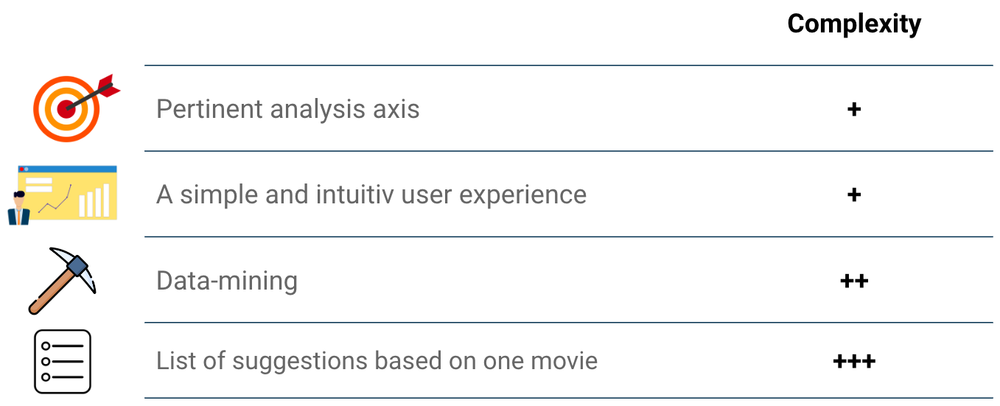
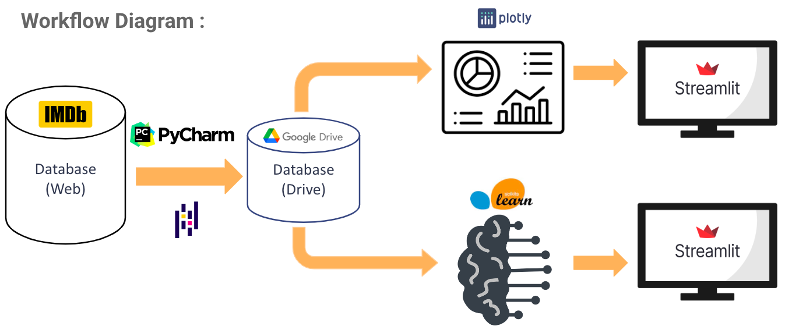

# :clapper:  Movie-Recommendation-System 
*Student Project with Python and Streamlit*

*As our csv files were too heavy, we coudn't put them on Git. Thus you won't be able to run those scripts.  
However you can take a look to our video files.*

## :beginner: Subject 

A cinema located in the lovely region of Creuse in France contacted us to create a movie recommendation system. 
An analysis of the database, with visual KPIs, were also part of the specifications.

## :dart: Product Backlogs

## :wrench: Tools

## :handshake: Team

<a href="https://github.com/Aurelien-GZL" target="_blank" rel="noopener noreferrer">
<a href="https://github.com/AlexCNZRZ" target="_blank" rel="noopener noreferrer">
<a href="https://github.com/boussalemmo" target="_blank" rel="noopener noreferrer">
<a href="https://github.com/MarionFourrier" target="_blank" rel="noopener noreferrer">
